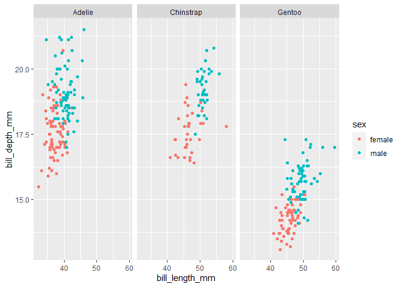
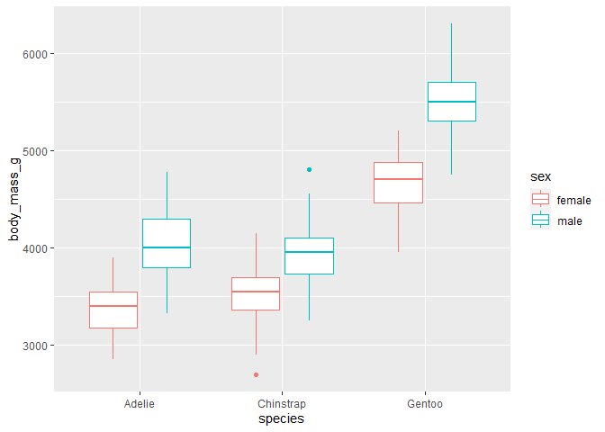
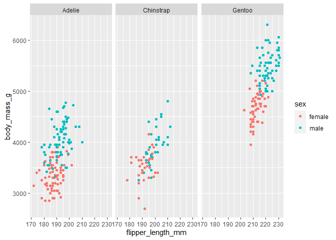
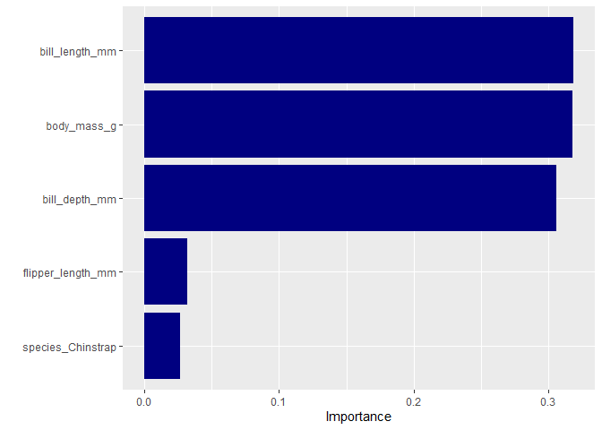

# PalmerPenguins


This time, we will build a XGboost model to classify the gender of
palmer penguins dataset. We also gonna use resampling method to measure
how well our model performance.

## Load library

``` r
library(tidyverse) 
library(tidymodels) 
library(palmerpenguins) 
library(vip)
```

## Dataset

``` r
penguin_df <- penguins
glimpse(penguin_df)
```

    Rows: 344
    Columns: 8
    $ species           <fct> Adelie, Adelie, Adelie, Adelie, Adelie, Adelie, Adel…
    $ island            <fct> Torgersen, Torgersen, Torgersen, Torgersen, Torgerse…
    $ bill_length_mm    <dbl> 39.1, 39.5, 40.3, NA, 36.7, 39.3, 38.9, 39.2, 34.1, …
    $ bill_depth_mm     <dbl> 18.7, 17.4, 18.0, NA, 19.3, 20.6, 17.8, 19.6, 18.1, …
    $ flipper_length_mm <int> 181, 186, 195, NA, 193, 190, 181, 195, 193, 190, 186…
    $ body_mass_g       <int> 3750, 3800, 3250, NA, 3450, 3650, 3625, 4675, 3475, …
    $ sex               <fct> male, female, female, NA, female, male, female, male…
    $ year              <int> 2007, 2007, 2007, 2007, 2007, 2007, 2007, 2007, 2007…

## Viz the dataset

From the visualization, we can say that male penguin bigger than female
penguin in terms of body mass and flipper lenght.

``` r
penguin_df <- penguin_df |>
  drop_na(sex) |>
  select(-year, -island)

penguin_df |> ggplot(aes(bill_length_mm, bill_depth_mm, color = sex)) +
  geom_point() +
  facet_wrap(~species)
```



``` r
penguin_df |> ggplot(aes(species, body_mass_g, color = sex)) +
  geom_boxplot()
```



``` r
penguin_df |> ggplot(aes(flipper_length_mm, body_mass_g, color = sex)) +
  geom_point() +
  facet_wrap(~species)
```



## Build a model

Before we build model, we split the data into training set and testing
set. After that, we use resampling method called V-fold cross validation
(CV) and build a xgboost model. For preprocessing, we impute the missing
data with median and then normalize the numeric predictors and create
dummy variable for categorical predictors.

``` r
set.seed(99)
penguin_split <- initial_split(penguin_df, prop = 0.7, strata = sex)
penguin_train <- training(penguin_split)
penguin_test <- testing(penguin_split)

penguin_fold <- vfold_cv(data = penguin_train, strata = sex)

bt_spec <- boost_tree() |>
  set_mode("classification") |>
  set_engine("xgboost")

penguin_recipe <- recipe(sex ~ ., data = penguin_train) |>
  step_impute_median(all_numeric_predictors()) |>
  step_normalize(all_numeric_predictors()) |>
  step_dummy(all_nominal_predictors())

penguin_wf <- workflow() |>
  add_recipe(penguin_recipe) |>
  add_model(bt_spec)

bt_fit <- penguin_wf |> fit_resamples(resamples = penguin_fold, control = control_resamples(save_pred = TRUE))
```

## Evaluating the model

As we can see, there are 10 results created from the resampling. Last,
we fit the test data and evaluate the model with accuracy and ROC, also
create confusion matrix

``` r
collect_metrics(bt_fit, summarize = FALSE)
```

    # A tibble: 20 × 5
       id     .metric  .estimator .estimate .config             
       <chr>  <chr>    <chr>          <dbl> <chr>               
     1 Fold01 accuracy binary         0.917 Preprocessor1_Model1
     2 Fold01 roc_auc  binary         0.986 Preprocessor1_Model1
     3 Fold02 accuracy binary         0.875 Preprocessor1_Model1
     4 Fold02 roc_auc  binary         0.892 Preprocessor1_Model1
     5 Fold03 accuracy binary         0.958 Preprocessor1_Model1
     6 Fold03 roc_auc  binary         0.972 Preprocessor1_Model1
     7 Fold04 accuracy binary         0.917 Preprocessor1_Model1
     8 Fold04 roc_auc  binary         0.993 Preprocessor1_Model1
     9 Fold05 accuracy binary         0.875 Preprocessor1_Model1
    10 Fold05 roc_auc  binary         0.917 Preprocessor1_Model1
    11 Fold06 accuracy binary         0.913 Preprocessor1_Model1
    12 Fold06 roc_auc  binary         0.970 Preprocessor1_Model1
    13 Fold07 accuracy binary         0.913 Preprocessor1_Model1
    14 Fold07 roc_auc  binary         0.962 Preprocessor1_Model1
    15 Fold08 accuracy binary         0.909 Preprocessor1_Model1
    16 Fold08 roc_auc  binary         0.959 Preprocessor1_Model1
    17 Fold09 accuracy binary         0.909 Preprocessor1_Model1
    18 Fold09 roc_auc  binary         0.983 Preprocessor1_Model1
    19 Fold10 accuracy binary         0.955 Preprocessor1_Model1
    20 Fold10 roc_auc  binary         1     Preprocessor1_Model1

``` r
penguin_final <- penguin_wf |>
  last_fit(penguin_split)

collect_metrics(penguin_final)
```

    # A tibble: 2 × 4
      .metric  .estimator .estimate .config             
      <chr>    <chr>          <dbl> <chr>               
    1 accuracy binary         0.901 Preprocessor1_Model1
    2 roc_auc  binary         0.960 Preprocessor1_Model1

``` r
result <- collect_predictions(penguin_final)

result |> conf_mat(sex, .pred_class)
```

              Truth
    Prediction female male
        female     41    1
        male        9   50

``` r
penguin_final |>
  extract_fit_parsnip() |>
  vip(aesthetics = list(fill = "navy"))
```


